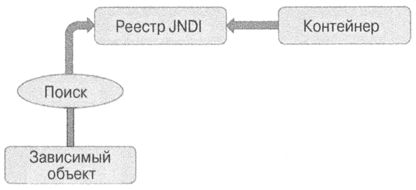
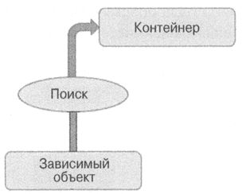

[< Назад](..%2F..%2FREADME.md)

# Вопросы по Java

<!-- TOC -->

* [Вопросы по Java](#вопросы-по-java)
    * [Перечислите методы класса Object](#перечислите-методы-класса-object)
    * [Расскажите про коллекции (Collection)?](#расскажите-про-коллекции-collection)
    * [WeakReference – слабые ссылки](#weakreference--слабые-ссылки)
        * [Общее Описание ссылка](#общее-описание-ссылка)
    * [всегда ли мы заходим в блок файнали?](#всегда-ли-мы-заходим-в-блок-файнали)
    * [Как потерять ключ в мапе?](#как-потерять-ключ-в-мапе)
    * [Расскажите про методы `wait`, `notify`, `notifyAll` и ключевое слово `synchronized`.](#расскажите-про-методы-wait-notify-notifyall-и-ключевое-слово-synchronized)
    * [Атомарная (греч. άτομος — неделимое) операция](#атомарная-греч-άτομος--неделимое-операция)
        * [JMM. Зачем нужно volatile](#jmm-зачем-нужно-volatile)
    * [Сборка мусора. Как работает? Какие сборщики знаете? Какие есть области памяти в JVM?](#сборка-мусора-как-работает-какие-сборщики-знаете-какие-есть-области-памяти-в-jvm)
        * [Структура памяти Java](#структура-памяти-java)
        * [Сборка мусора: введение](#сборка-мусора-введение)
        * [Сборка мусора: процесс](#сборка-мусора-процесс)
        * [Поколения объектов](#поколения-объектов)
        * [Что такое Stop the World?](#что-такое-stop-the-world)
        * [Что такое гипотеза о поколениях?](#что-такое-гипотеза-о-поколениях)
        * [Преимущества использования поколений](#преимущества-использования-поколений)
        * [Недостатки использования поколений](#недостатки-использования-поколений)
        * [Сборка мусора: флаги](#сборка-мусора-флаги)
        * [Типы сборщиков мусора](#типы-сборщиков-мусора)
    * [Список паттернов проектирования:](#список-паттернов-проектирования)
    * [Внедрение зависимостей - это специальный паттерн, который уменьшает связь между Spring компонентами.](#внедрение-зависимостей---это-специальный-паттерн-который-уменьшает-связь-между-spring-компонентами)
    * [Преимущества DI:](#преимущества-di)
    * [Почему для создания Spring beans рекомендуются интерфейсы?](#почему-для-создания-spring-beans-рекомендуются-интерфейсы)
    * [14. Что такое application context?](#14-что-такое-application-context)
    * [Что такое контейнер и какой у него жизненный цикл?](#что-такое-контейнер-и-какой-у-него-жизненный-цикл)
        * [Жизненный цикл контейнера:](#жизненный-цикл-контейнера)
    * [Как создать экземпляр ApplicationContext?](#как-создать-экземпляр-applicationcontext)
        * [Примеры создания контекста:](#примеры-создания-контекста)
    * [Можете ли вы описать жизненный цикл бина в контейнере?](#можете-ли-вы-описать-жизненный-цикл-бина-в-контейнере)
    * [Как получить ApplicationContext в интеграционном тесте?](#как-получить-applicationcontext-в-интеграционном-тесте)
    * [Потоки в SpringBoot. Откуда берутся? Сколько по умолчанию? Как управлять количеством?](#потоки-в-springboot-откуда-берутся-сколько-по-умолчанию-как-управлять-количеством)
    * [Различия 8, 9, 11, 17 версий java](#различия-8-9-11-17-версий-java)
    * [Java 8 (Что нового)](#java-8-что-нового)
    * [Java 9 (Что нового)](#java-9-что-нового)
    * [Стирание типов](#стирание-типов)
    * [Дженерики](#дженерики)
    * [Многопоточность](#многопоточность)
    * [Создание потоков](#создание-потоков)
    * [deadlock](#deadlock)
    * [Race condition](#race-condition)
    * [Неоднозначность бинов](#неоднозначность-бинов)
    * [Виды прокси](#виды-прокси)
    * [Паттерны проектирования](#паттерны-проектирования)
    * [Динамическая диспетчеризация](#динамическая-диспетчеризация)
    * [Раннее и позднее связывание в Java](#раннее-и-позднее-связывание-в-java)
        * [Раннее и позднее связывание в Java](#раннее-и-позднее-связывание-в-java-1)
        * [Пример статического и динамического связывания в Java](#пример-статического-и-динамического-связывания-в-java)
        * [Различия между ранним и поздним связыванием в языке Java](#различия-между-ранним-и-поздним-связыванием-в-языке-java)
    * [Тред пулл](#тред-пулл)
    * [Streap api паралельное](#streap-api-паралельное)
    * [20. При создании строки через оператор new, она помещается в heap (Оператор new выделяет новый участок памяти в хипе)](#20-при-создании-строки-через-оператор-new-она-помещается-в-heap-оператор-new-выделяет-новый-участок-памяти-в-хипе)
    * [IoC](#ioc)
        * [Извлечение зависимостей:](#извлечение-зависимостей)
        * [Контекстный поиск зависимостей:](#контекстный-поиск-зависимостей)
        * [Внедрение зависимостей через конструктор](#внедрение-зависимостей-через-конструктор)
        * [Внедрение зависимостей через метод установки](#внедрение-зависимостей-через-метод-установки)
        * [Выбор между внедрением и поиском зависимостей](#выбор-между-внедрением-и-поиском-зависимостей)
    * [Разница IoC и DI ссылка](#разница-ioc-и-di-ссылка)
    * [Been - класс, который создается и конфигурируется внутри контекста...](#been---класс-который-создается-и-конфигурируется-внутри-контекста)
    * [Диспатчер сервлет и контроллер](#диспатчер-сервлет-и-контроллер)
    * [SOLID (Депенденси инверсион. тест дривоп девелопмент (разработка через тестирование))](#solid-депенденси-инверсион-тест-дривоп-девелопмент-разработка-через-тестирование)
    * [Транзакция](#транзакция)
    * [Как устроен String (Закроем вопрос)](#как-устроен-string-закроем-вопрос)

<!-- TOC -->

## Перечислите методы класса Object

* clone
* equals
* finalize (Deprecated)
* getClass
* hashCode
* toString
* notify
* notifyAll
* wait

## Расскажите про коллекции (Collection)?

Контр вопрос:

* Есть ли метод E get(int index) у LinkedList?

> Конечно есть, так как он реализует интерфейс List

## WeakReference – слабые ссылки

Если на объект не осталось обычных ссылок и мягких ссылок, а только слабые ссылки, то этот объект является живым, но он
будет уничтожен при ближайшей сборке мусора.

* WeakHashMap не предназначена для использования в качестве кэша. WeakReference создается для ключа а не для значения. И
  данные будут удалены только после того как в программе не останется strong-ссылок на ключ а не на значение. В
  большинстве случаев это не то чего вы хотите достичь кэшированием.
* Данные с WeakHashMap будут удалены не сразу после того как GC обнаружит что ключ доступен только через weak-ссылки.
  Фактически очистка произойдет при следующем обращении к WeakHashMap.
* В первую очередь WeakHashMap предназначен для использования с ключами, у которых метод equals проверяет идентичность
  объектов (использует оператор ==). Как только доступ к ключу потерян, его уже нельзя создать заново.

#### Общее Описание [ссылка](https://habr.com/ru/articles/169883/)

Для начала немного общей теории. Вспомним, в общих чертах, как работает Garbage Collector (далее GC). Если не вдаваться
в детали, то алгоритм прост: при запуске сборщика виртуальная машина рекурсивно находит, для всех потоков, все доступные
объекты в памяти и помечает их неким образом. А на следующем шаге GC удаляет из памяти все непомеченные объекты. Таким
образом, после чистки, в памяти будут находиться только те объекты, которые могут быть полезны программе. Идем дальше.
В Java есть несколько видов ссылок. Есть StrongReference — это самые обычные ссылки которые мы создаем каждый день.

```
StringBuilder builder = new StringBuilder();
```

**builder** это и есть strong-ссылка на объект StringBuilder.

И есть 3 «особых» типа ссылок — SoftReference, WeakReference, PhantomReference.

1. `SoftReference` — если GC видит что объект доступен только через цепочку soft-ссылок, то он удалит его из памяти.
   Потом. Наверно.
2. `WeakReference` — если GC видит что объект доступен только через цепочку weak-ссылок, то он удалит его из памяти.
3. `PhantomReference` — если GC видит что объект доступен только через цепочку phantom-ссылок, то он его удалит из
   памяти. После нескольких запусков GC

Эти 3 типа ссылок наследуются от одного родителя — `Reference`, у которого они собственно и берут все свои public методы
и конструкторы.

```
StringBuilder builder = new StringBuilder();
SoftReference<StringBuilder> softBuilder = new SoftReference(builder);
```

После выполнения этих двух строчек у нас будет 2 типа ссылок на 1 объект StringBuilder:

* builder — strong-ссылка
* softBuilder — soft-ссылка (формально это strong-ссылка на soft-ссылку, но для простоты я буду писать soft-ссылка)

И если во время выполнения программы, переменная builder станет недоступной, но при этом ссылка на объект, на который
ссылается softBuilder, будет еще доступна И запустится GC -> то объект StringBuilder будет помечен как доступный только
через цепочку soft-ссылок.

**Рассмотрим доступные методы:**
softBuilder.get() — вернет strong-ссылку на объект StringBuilder в случае если GC не удалил этот объект из памяти. В
другом случае вернется null.
softBuilder.clear() — удалит ссылку на объект StringBuilder (то есть soft-ссылки на этот объект больше нет)
Все то же самое работает и для WeakReference и для PhantomReference. Правда, PhantomReference.get() всегда будет
возвращать null.

## всегда ли мы заходим в блок файнали?

## Как потерять ключ в мапе?

## Расскажите про методы `wait`, `notify`, `notifyAll` и ключевое слово `synchronized`.

`Метод wait()` У метода wait() есть три вариации. Один метод wait() бесконечно ждет другой поток, пока не будет
вызван метод notify() или notifyAll() на объекте. Другие две вариации метода wait() ставят текущий поток в ожидание на
определенное время. По истечении этого времени поток просыпается и продолжает работу.

`Метод notify()` Вызов метод notify() пробуждает только один поток, после чего этот поток начинает выполнение. Если
объект ожидают несколько потоков, то метод notify() разбудит только один из них. Выбор потока зависит от системной
реализации управления потоками.

`Метод notifyAll()` Метод notifyAll() пробуждает все потоки, хотя в какой последовательности они будут пробуждаться
зависит от реализации ОС.

## Атомарная (греч. άτομος — неделимое) операция

Атомарная (греч. άτομος — неделимое) операция — операция, которая либо выполняется целиком, либо не выполняется вовсе;
Операция, которая не может быть частично выполнена и частично не выполнена.

### JMM. Зачем нужно volatile

[раз](https://www.youtube.com/watch?v=CI_rOvL-OTE)

Если необходимо синхронизировать переменную между потоками, ее необходимо пометить как volatile (изменчивый)
volatile - гарантирует когерентность кэша ядер. При этом переменная, помеченная volatile, не будет кешироваться в
кеше каждого ядра, а будет располагаться в главной памяти и каждый поток будет обращаться главной памяти,
чтоб взять свежее значение переменной.

**Итог:**
> Если один поток записывает в переменную, а другой потом читает ее, то ее необходимо всегда помечать как volatile

Когерентность кэша (англ. cache coherence) — свойство кэшей, означающее целостность данных, хранящихся в локальных
кэшах для разделяемого ресурса.


## Список паттернов проектирования:

[раз](https://javarush.com/quests/lectures?quest=QUEST_JRU_JAVA_PROFESSIONAL&level=16),
[два](https://javarush.com/quests/lectures/questservlets.level16.lecture00)

 ```
 B — поведенческие (behavioral)    
 C — порождающие (creational)    
 S — структурные (structural)

 C — Абстрактная фабрика
 S — Адаптер
 S — Мост
 C — Строитель
 B — Цепочка обязанностей
 B — Команда
 S — Компоновщик
 S — Декоратор
 S — Фасад
 C — Фабричный метод
 S — Приспособленец
 B — Интерпретатор
 B — Итератор
 B — Посредник
 B — Хранитель
 C — Прототип
 S — Прокси
 B — Наблюдатель
 C — Одиночка
 B — Состояние
 B — Стратегия
 B — Шаблонный метод
 B — Посетитель
 ```

## Внедрение зависимостей - это специальный паттерн, который уменьшает связь между Spring компонентами.

Таким образом, при применении DI, ваш код становится чище, проще, его становится легче понять и тестировать.
Согласно паттерну DI, создание объектов для зависимостей переходит на фабрику или отдается третьей стороне.
Это означает, что мы можем сосредоточиться на использовании этих объектов вместо их создания.

## Преимущества DI:

- Уменьшенная связь между частями приложения
- Улучшенное тестирование
- Улучшенная архитектура приложения
- Уменьшает шаблонный код
- Стандартизирует разработку приложения

## Почему для создания Spring beans рекомендуются интерфейсы?

- Улучшенное тестирование. В тестах бин может быть заменен специальным объектом(mock или stub), который реализует
  интерфейс бина.
- Позволяет использовать механизм динамических прокси из JDK(например, при создании репозитория через Spring Data)
- Позволяет скрывать реализацию

## 14. Что такое application context?

В Spring Framework интерфейс org.springframework.factory.BeanFactory предоставляет фабрику для бинов, которая в то
же время является IoC контейнером приложения.
Управление бинами основано на конфигурации(java или xml).

Интерфейс org.springframework.context.ApplicationContext — это обертка над bean factory, предоставляющая некоторые
дополнительные возможности,
например AOP, транзакции, безопасность, i18n, и т.п.

## Что такое контейнер и какой у него жизненный цикл?

Основа Spring Framework — контейнер, и наши объекты "живут" в этом контейнере.
Контейнер обычно создает множество объектов на основе их конфигураций и управляет их жизненным циклом от создания
объекта до уничтожения.

Контейнер — это объект, реализующий интерфейс ApplicationContext.

#### Жизненный цикл контейнера:

- Контейнер создается при запуске приложения
- Контейнер считывает конфигурационные данные
- Из конфигурационных данных создается описание бинов
- BeanFactoryPostProcessors обрабатывают описание бина
- Контейнер создает бины используя их описание
- Бины инициализируются — значения свойств и зависимости внедряются в бин
- BeanPostProcessor запускают методы обратного вызова(callback methods)
- Приложение запущено и работает
- Инициализируется закрытие приложения
- Контейнер закрывается
- Вызываются callback methods

## Как создать экземпляр ApplicationContext?

Spring обеспечивает несколько разновидностей контекста.

Есть несколько основных реализаций интерфейса ApplicationContext:

- FileSystemXmlApplicationContext
- ClassPathXmlApplicationContext
- AnnotationConfigApplicationContext
- XmlWebApplicationContext
- AnnotationConfigWebApplicationContext

#### Примеры создания контекста:

 ```
 ApplicationContext ctx = new FileSystemXmlApplicationContext("c:/bean_properties.xml");
 
 ApplicationContext ctx = new AnnotationConfigApplicationContext("com.springdemoapp.JavaConfig.class");
 ```

## Можете ли вы описать жизненный цикл бина в контейнере?

1. Загрузка описаний бинов, создание графа зависимостей(между бинами)
2. Создание и запуск BeanFactoryPostProcessors
3. Создание бинов
4. Spring внедряет значения и зависимости в свойства бина
5. Если бин реализует метод setBeanName() из интерфейса NameBeanAware, то ID бина передается в метод
6. Если бин реализует BeanFactoryAware, то Spring устанавливает ссылку на bean factory через setBeanFactory() из
   этого интерфейса.
7. Если бин реализует интерфейс ApplicationContextAware, то Spring устанавливает ссылку на ApplicationContext через
   setApplicationContext().
8. BeanPostProcessor это специальный интерфейс(о нем ниже), и Spring позволяет бинам имплементировать этот
   интерфейс.
   Реализуя метод postProcessBeforeInitialization(), можно изменить экземпляр бина перед его(бина) инициализацией(
   установка свойств и т.п.)
9. Если определены методы обратного вызова, то Spring вызывает их. Например, это метод, аннотированный
   @PostConstruct или метод initMethod из аннотации @Bean.
10. Теперь бин готов к использованию. Его можно получить с помощью метода ApplicationContext#getBean().
11. После того как контекст будет закрыт(метод close() из ApplicationContext), бин уничтожается.
12. Если в бине есть метод, аннотированный @PreDestroy, то перед уничтожением вызовется этот метод.
    Если бин имплементирует DisposibleBean, то Spring вызовет метод destroy(),
    чтобы очистить ресурсы или убить процессы в приложении.
    Если в аннотации @Bean определен метод destroyMethod, то вызовется и он.

## Как получить ApplicationContext в интеграционном тесте?

Если вы используете JUnit 5, то вам нужно указать 2 аннотации:
@ExtendWith(TestClass.class) — используется для указания тестового класса
@ContextConfoguration(classes = JavaConfig.class) — загружает java/xml конфигурацию для создания контекста в тесте

Можно использовать аннотацию @SpringJUnitConfig, которая сочетает обе эти аннотации.
Для теста веб-слоя можно использовать аннотацию @SpringJUnitWebConfig.

## Потоки в SpringBoot. Откуда берутся? Сколько по умолчанию? Как управлять количеством?

## Различия 8, 9, 11, 17 версий java

## Java 8 (Что нового)

https://javarush.com/groups/posts/2547-iz-8-v-13-polnihy-obzor-versiy-java-chastjh-1

1. Functional Interface (Функциональный интерфейс) — это интерфейс, содержащий один нереализованный (абстрактный)
   метод.
   @FunctionalInterface — необязательная аннотация, которая ставится над таким интерфейсом.
   Нужна для проверки того, соответствует ли он требованиям функционального интерфейса (наличие только одного
   абстрактного метода).

2. Stream (Стримы) — это способ обрабатывать структуры данных в функциональном стиле.
   Как правило это коллекции (но можно использовать их в других, менее распространённых ситуациях).
   Более понятным языком, Stream — это поток данных, который мы обрабатываем как бы работая со всеми данными
   одновременно,
   а не перебором, как при for-each.

3. Lambda - Это блок кода, который можно передать в различные места, исходя из этого он может быть выполнен позже
   столько раз, сколько потребуется.

4. foreach - который работает с потоком данных как и стрим.

5. Method reference (Ссылочные методы) — это новый полезный синтаксис, созданный чтобы ссылаться на существующие
   методы или конструкторы Java-классов или объектов через ::

6. API Time - библиотека для работы с датами и временем — java.time. Новый API схож с любой Joda-Time.

7. Optional - Это новый класс в пакете java.util, обёртка (контейнер) для значений, фишкой которой является то, что
   она также может безопасно содержать null.

## Java 9 (Что нового)

[раз](https://javarush.com/groups/posts/2547-iz-8-v-13-polnihy-obzor-versiy-java-chastjh-1#:~:text=8%20Tutorial.-,Java%209,-%D0%98%D1%82%D0%B0%D0%BA%2C%2021%20%D1%81%D0%B5%D0%BD%D1%82%D1%8F%D0%B1%D1%80%D1%8F)

1. JShell (REPL — read-eval-print loop) - Это реализация в Java интерактивной консоли,
   которая используется для тестирования функционала и использования в консоли разных конструкций,
   например интерфейсов, классов, enum, операторов и т.д.

   Для запуска JShell нужно лишь написать в терминале — jshell.

2. Private - Начиная с 9 версии Java, у нас появилась возможность использовать private методы в интерфейсах
   (default и static методы, так как другие мы попросту не можем переопределить из-за недостаточного доступа).

3. Immutable Collection - стало возможным создание и заполнение коллекции одной строкой, при этом делая её immutable
   (ранее для создания immutable коллекции нам нужно было создать коллекцию, заполнить её данными, и вызов метода,
   например — Collections.unmodifiableList).

4. Расширен Optional (добавлены новые методы);
5. Появились интерфейсы ProcessHandle и ProcessHandle для управления действиями операционной системы;
6. G1 — дефолтный сборщик мусора;
7. HTTP клиент с поддержкой как HTTP/2 протокола и WebSocket;
8. Расширен Stream;
9. Добавлен фреймворк Reactive Streams API (для реактивного программирования);

## Стирание типов

## Дженерики

## Многопоточность

## Создание потоков

## deadlock

## Race condition

## Неоднозначность бинов

## Виды прокси

## Тестирования
https://www.youtube.com/playlist?list=PLAma_mKffTOTtGQEbqurDRoPwDEKzzZQA

## Инвертирование зависимостей
https://javarush.com/quests/lectures/questservlets.level14.lecture08

## Архитектура приложения
https://javarush.com/quests/lectures?quest=QUEST_JRU_JAVA_PROFESSIONAL&level=14

## Память в JVM (JMM)
https://javarush.com/quests/lectures?quest=QUEST_JRU_JAVA_PROFESSIONAL&level=18

## Паттерны проектирования
https://javarush.com/quests/lectures?quest=QUEST_JRU_JAVA_PROFESSIONAL&level=17

## Динамическая диспетчеризация

Динамическая диспетчеризация методов – это механизм, с помощью которого решение на вызов переопределенного метода
принимается во время выполнения, а не во время компиляции. Динамическая диспетчеризация методов важна при реализации
полиморфизма.


Java Использует факт того, что ссылочная переменная суперкласса может обращаться к объекту подкласса, чтобы принимать
решение о вызове переопределенных методов **во время выполнения**. Когда переопределенный метод вызывается через ссылку
суперкласса, Java определяет, какую версию этого метода выполнить, основываясь на `типе объекта`, на который указывает
ссылка в момент вызова. Другими словами именно `тип объекта, на который сделана ссылка` (а не ссылочной переменной)
определяет, какая версия переопределенного метода будет выполнена.

## Раннее и позднее связывание в Java

[ссылка](https://javarush.com/groups/posts/439-razlichija-mezhdu-rannim-i-pozdnim-svjazihvaniem-v-java)
Существует два типа связывания методов в языке Java: ранее связывание (его ещё называют статическим) и позднее (
соответственно, динамическое) связывание. Вызов метода в Java означает, что этот метод привязывается к конкретному коду
или в момент компиляции, или во время выполнения, при запуске программы и создании объектов.

Можно понять из названия, статическое связывание носит более статический характер, так как происходит во время
компиляции, то есть код «знает», какой метод вызывать после компиляции исходного кода на Java в файлы классов. А
поскольку это относится к ранней стадии жизненного цикла программы, то называется также ранним связыванием (early
binding).

С другой стороны, динамическое связывание происходит во время выполнения, после запуска программы виртуальной машиной
Java. В этом случае то, какой метод вызвать, определяется конкретным объектом, так что в момент компиляции информация
недоступна, ведь объекты создаются во время выполнения. А поскольку это происходит на поздней стадии жизненного цикла
программы, то называется в языке Java поздним связыванием (late binding).

> Итак, фундаментальное различие между статическим и динамическим связыванием в Java состоит в том, что первое
> происходит рано, во время компиляции на основе типа ссылочной переменной, а второе – позднее, во время выполнения, с
> использованием конкретных объектов.

### Раннее и позднее связывание в Java

Существует множество различий статического и динамического связывания в языке Java, но важнейшее – то, как их использует
JVM. Задумывались ли вы когда-нибудь, каким образом JVM решает, какой метод вызвать, если в области видимости содержится
более одного метода с одним именем? Если вы когда-либо использовали перегрузку или переопределение методов, то знаете,
что в Java может быть несколько методов с одним именем. В случае с Java виртуальная машина JVM использует как
статическое, так и динамическое связывание для выбора нужного метода.

### Пример статического и динамического связывания в Java

В этой программе вы увидите, что привязка виртуальных методов не происходит во время компиляции при помощи статического
связывания, поскольку в этом случае вызывался бы метод из суперкласса, как происходит со статическими методами, которые
связываются рано. Если будет вызван метод из подкласса, то для связывания функции использовался конкретный объект во
время выполнения, а, следовательно, для связывания виртуальных функций используется динамическое связывание.

```java
public class Main {
    public static void main(String[] args) {

        // Пример статического и динамического связывания в Java
        Insurance current = new CarInsurance();

        // Динамическое связывание на основе объекта
        int premium = current.premium();

        // Статическое связывание на основе класса
        String category = current.category();

        System.out.println("premium : " + premium);
        System.out.println("category : " + category);
    }
}

class Insurance {
    public static final int LOW = 100;

    public int premium() {
        return LOW;
    }

    public static String category() {
        return "Insurance";
    }

}

class CarInsurance extends Insurance {
    public static final int HIGH = 200;

    public int premium() {
        return HIGH;
    }

    public static String category() {
        return "Car Insurance";
    }

}
```

```
Результаты выполнения:

premium : 200
category : Insurance
```

Как вы видите, вызов метода `premium()` привел к выполнению метода из подкласса, в то время как вызов
метода `category()`
привел к выполнению метода суперкласса. Это происходит из-за того, что `premium()` – виртуальный метод, который
разрешается при помощи позднего связывания, в то время как `category()` – статический метод, который разрешается при
помощи статического связывания во время компиляции по имени класса.

### Различия между ранним и поздним связыванием в языке Java

Теперь, когда вы разобрались и понимаете, как в языке Java связываются вызовы методов и как функционирует статическое и
динамическое связывание, давайте еще раз перечислим ключевые различия между ранним и поздним связыванием в языке Java:
Статическое связывание происходит во время компиляции, а динамическое – во время выполнения.

Поскольку статическое связывание происходит на ранней стадии жизненного цикла программы, его называют ранним
связыванием. Аналогично, динамическое связывание называют также поздним связыванием, поскольку оно происходит позже, во
время работы программы.

Статическое связывание используется в языке Java для разрешения перегруженных методов, в то время как динамическое
связывание используется в языке Java для разрешения переопределенных методов.

Аналогично, приватные, статические и терминальные методы разрешаются при помощи статического связывания, поскольку их
нельзя переопределять, а все виртуальные методы разрешаются при помощи динамического связывания.

В случае статического связывания используются не конкретные объекты, а информация о типе, то есть для обнаружения
нужного метода используется тип ссылочной переменной. С другой стороны, при динамическом связывании для нахождения
нужного метода в Java используется конкретный объект.

> Всегда помните, что **приватные**, **статические** и **final-методы** связываются при помощи
> **статического связывания**, а **виртуальные** – **динамического**. Аналогично, лучший пример статического
> связывания – перегрузка методов, а переопределение – динамического.

## Тред пулл

## Streap api паралельное

## 20. При создании строки через оператор new, она помещается в heap (Оператор new выделяет новый участок памяти в хипе)

## IoC

IoC - инверсия управления может быть разделена на два подтипа: внедрение зависимостей и поиск зависимостей. Эти
подтипы подразделяются далее на конкретные реализации служб инверсии управления. Из этого определения ясно видно,
что когда речь идет о внедрении зависимостей, всегда имеется в виду инверсия управления. Но когда речь идет об
инверсии управления,
то не всегда имеется в виду внедрение зависимостей. Например, поиск зависимостей - это также форма инверсии
управления.

Первый тип - поиск зависимостей - является намного более традиционным подходом и на первый взгляд выглядит более
знакомым тем,
кто программирует на Java. Второй тип - внедрения зависимостей - в действительности обеспечивает более высокую
гибкость
и удобство применения по сравнению с поиском зависимостей, хотя поначалу он кажется нелогичным.

Если инверсия управления реализуется как поиск зависимостей, то компонент должен получить ссылку на зависимость,
тогда как при внедрении зависимостей последние внедряются в компонент контейнером инверсии управления.
У поиска зависимостей имеются две разновидности: извлечение зависимостей и контекстный поиск зависимостей (CDL).
И у внедрения зависимостей имеются две разновидности: через конструктор и через метод установки.

#### Извлечение зависимостей:

Для разработчика приложений на Java извлечение зависимостей является самым узнаваемым типом инверсии управления.
В этом случае зависимости извлекаются из реестра по мере необходимости. Всякий, кому приходилось писать код для
доступа
к каркасу EJB (вплоть до версии 2.1), пользовался извлечением зависимостей (через прикладной интерфейс JNDI API
для поиска компонента ЕJВ).

|  |
|:---------------------------------------------------------------------------:|
|           **Извлечение зависимостей через поиск в реестре JNDI**            |

Извлечение зависимостей предоставляется и в каркасе Spring как механизм для извлечения компонентов, которыми он
управляет.

**Пример:**

```java
public class DependencyPull {
    public static void main(String... args) {
        ApplicationContext ctx = new ClassPathXmlApplicationContext("spring/app-context.xml");
        MessageRenderer mr = ctx.getBean("renderer", MessageRenderer.class);
        mr.render();
    }
}
```        

Этот тип инверсии управления не только преобладает в приложениях на платформе JEE,
где применяется каркас EJB вплоть до версии 2.1 и широко употребляются операции поиска в службе JNDI
для получения зависимостей из реестра, но и играет ключевую роль в работе с Spring во многих средах.

#### Контекстный поиск зависимостей:

В известной мере контекстный поиск зависимостей (CDL) nодобен извлечению зависимостей,
но в этом случае поиск осуществляется в контейнере, управляющем ресурсом, а не только в каком-то центральном
реестре.
Как правило, контекстный поиск зависимостей производится в установленной точке.



Механизм контекстного поиска приводится в действие через реализацию в компоненте интерфейса,
аналогично приведенному в следующем фрагменте кода:

```java
public interface ManagedComponent {
    void performLookup(Container container);
}
```

Реализуя этот интерфейс, комnонент извещает контейнер, что ему требуется получить зависимость.
Контейнер обычно предоставляется базовым сервером приложений (например, Tomcat или JBoss)
или каркасом (в частности, Spring). В следующем фрагменте кода приведен простой интерфейс Container,
предоставляющий услуги поиска зависимостей:

```java
public interface Container {
    Object getDependency(String key);
}
```

Как только контейнер будет готов передать зависимости компоненту, он вызовет метод performLookup()
по очереди для каждого компонента. И тогда компонент сможет искать свои зависимости,
используя интерфейс Container, как показано в следующем фрагменте кода:

```java
public class ContextualizedDependencyLookup implements ManagedComponent {
    private Dependency dependency;

    @Override
    public void performLookup(Container container) {
        this.dependency = (Dependency) container.getDependency("myDependency");
    }

    @Override
    public String toString() {
        return dependency.toString();
    }
}
```

#### Внедрение зависимостей через конструктор

Внедрение зависимостей через конструктор происходит в том случае, когда зависимости предоставляются компоненту в его
конструкторе (или нескольких конструкторах). С этой целью в компоненте объявляется один или ряд конструкторов,
получающих в качестве аргументов его зависимости, а контейнер инверсии управления передает зависимости компоненту при
получении его экземпляра, как показано в приведенном ниже фрагменте кода. Очевидно, что вследствие внедрения
зависимостей через конструктор объект не может быть создан без зависимостей, а следовательно, они обязательны.

```java
public class ConstructorInjection {
    private Dependency dependency;

    public ConstructorInjection(Dependency dependency) {
        this.dependency = dependency;
    }

    @Override
    public String toString() {
        return dependency.toString();
    }
}
```

#### Внедрение зависимостей через метод установки

При внедрении зависимостей через метод установки контейнер инверсии управления внедряет зависимости компонента через
методы установки в стиле компонентов JavaBeans. Методы установки компонента отражают зависимости, которыми может
управлять контейнер инверсии управления. В приведенном ниже фрагменте кода показан типичный компонент, основанный на
внедрении зависимостей через метод установки. Очевидно, что вследствие внедрения зависимостей через метод установки
объект может быть создан без зависимостей, которые могут быть предоставлены в дальнейшем через вызов метода установки.

```java
public class SetterInjection {
    private Dependency dependency;

    public void setDependency(Dependency dependency) {
        this.dependency = dependency;
    }

    @Override
    public String toString() {
        return dependency.toString();
    }
}
```

Требование зависимости, предоставляемое через метод setDependency(), обозначается в контейнере по имени в стиле
компонентов JavaBeans (в данном случае - dependency). На практике внедрение зависимостей через метод установки
оказывается наиболее широко применяемым механизмом инверсии управления, который проще всего реализовать.

#### Выбор между внедрением и поиском зависимостей

Выбрать конкретный тип инверсии управления для применения - внедрение или поиск зависимостей - обычно не трудно. Как
правило, выбор типа инверсии управления зависит от применяемого контейнера. Так, если применяется каркас EJB (вплоть до
версии 2.1), то следует выбрать инверсию управления в стиле поиска (через службу JNDI), чтобы получить доступ к ЕJВ из
контейнера JEE. А в Spring компоненты и их зависимости всегда связываются вместе с помощью инверсии управления в стиле
внедрения, за исключением первоначальных поисков компонентов Spring Beans.

**На заметку**
> Применяя Spriпg, можно получить доступ к ресурсам EJB, и не прибегая
> к явному поиску. Каркас Spring может действовать в роли адаптера между системами инверсии
> управления в стиле поиска и внедрения, позволяя таким образом управлять всеми ресурсами
> с помощью внедрения.

Вопрос на самом деле заключается в следующем: когда есть выбор, то какой тип инверсии управления должен использоваться:
внедрение или поиск зависимостей? Очевидно, что внедрение. Если обратиться к приведенным выше примерам исходного кода,
то можно заметить, что внедрение зависимостей не оказывает никакого влияния на исходный код компонентов. С другой
стороны, код, реализующий извлечение зависимостей, должен активно получать ссылку на реестр и взаимодействовать с ним
при получении зависимостей, а для применения контекстного поиска зависимостей требуется, чтобы в классах был реализован
конкретный интерфейс и поиск зависимостей вручную. Если же выбрать внедрение зависимостей, то в классах достаточно
разрешить их внедрение через конструкторы или же через методы установки. Выбрав внедрение зависимостей, можно
пользоваться своими классами полностью отдельно от контейнера инверсии управления, который поставляет зависимые объекты
и взаимодействующие с ними объекты вручную, тогда как при поиске зависимостей классы всегда будут зависеть от классов и
интерфейсов, определяемых в контейнере инверсии управления. Еще один недостаток поиска зависимостей состоит в том, что
он сильно затрудняет тестирование классов отдельно от контейнера. А при внедрении зависимостей тестирование компонентов
не составит особого труда, поскольку для этого достаточно предоставить зависимости с помощью подходящего конструктора
или метода установки.

Решения на основе поиска зависимостей неизбежно оказываются более сложными, чем решения, основанные на внедрении
зависимостей. И хотя такой сложности не следует бояться, мы ставим под сомнение обоснованность излишнего усложнения
процесса в целом, поскольку считаем этот аспект не менее важным, чем управление зависимостями в приложении. Если
оставить все эти второстепенные причины в стороне, то главной причиной для выбора внедрения, а не поиска зависимостей
является значительное упрощение задачи разработки. Если выбрать внедрение зависимостей, то придется написать намного
меньше кода, который окажется несложным и, как правило, генерируемым автоматически в хорошей IDE. Обратите внимание на
то, что весь код в примерах внедрения зависимостей является пассивным в том смысле, что он не пытается активно выполнить
какую-то задачу. Но самое примечательное в таком коде состоит в том, что получаемые обьекты хранятся только в полях, а
для извлечения зависимости из любого реестра или контейнера никакого другого кода не требуется. Таким образом, код
оказывается намного более простым и менее подверженным ошибкам. Пассивный код легче сопровождать, чем активный,
поскольку в нем мало что может пойти не так. Рассмотрим следующий фрагмент кода, взятый из приведенного выше примера
контекстного поиска зависимостей:

```
public void performLookup(Container container){
   this.dependency=(Dependency)
   container.getDependency("myDependency");
}
```

В этом коде многое может пойти не так, как было задумано: ключ зависимости может измениться, экземпляр контейнера может
оказаться пустым (null), а возвращаемая зависимость - относиться к неподходящему типу. Мы привели этот код потому, что
он содержит большое количество подвижных частей, и в нем может быть многое нарушено. Внедрение зависимостей способствует
развязке компонентов в приложении, но в то же время усложняет дополнительный код, который требуется для того, чтобы
связать эти компоненты вместе и решить любые полезные задачи.

## Разница IoC и DI [ссылка](https://habr.com/ru/articles/131993/)

Inversion of Control IoC (инверсия управления) - это абстрактный принцип, набор рекомендаций для написания слабо
связанного кода.
Суть которого в том, что каждый компонент системы должен быть как можно более изолированным от других,
не полагаясь в своей работе на детали конкретной реализации других компонентов.
Dependency injection DI (внедрение зависимостей) — это одна из реализаций IoC принципа (помимо этого есть еще
Factory Method, Service Locator).

[Factory Method](https://habr.com/ru/articles/556512/)

[Service Locator](https://habr.com/ru/companies/otus/articles/694458/)

IoC-контейнер — это какая-то библиотека, фреймворк, программа если хотите,
которая позволит вам упростить и автоматизировать написание кода с использованием данного подхода на столько, на
сколько это возможно.

## Been - класс, который создается и конфигурируется внутри контекста...

## Диспатчер сервлет и контроллер

## SOLID (Депенденси инверсион. тест дривоп девелопмент (разработка через тестирование))
https://habr.com/ru/articles/688530/
https://www.youtube.com/watch?v=StWB7NJjPZc&t=727s

## Транзакция

Tranzactional inbox (20:00) [раз](https://www.youtube.com/watch?v=ajU9HZP6q8c)

Транзакция - группа последовательных операций с одной БД, которая предсавляет собой логическую единицу работы с
данными. Транзакция может быть выполнена либо целиком и успешно, соблюдая целостность данных и независимо от параллельно
идущих других транзакций, либо не выполнена вообще, и тогда она не должна произвести никакого эфекта.
[раз](https://www.youtube.com/watch?v=QZ9rXZT0DlQ&t=2s) https://habr.com/ru/companies/rosbank/articles/707378/)

## Как устроен String ([Закроем вопрос](string_pool_in_java.md))