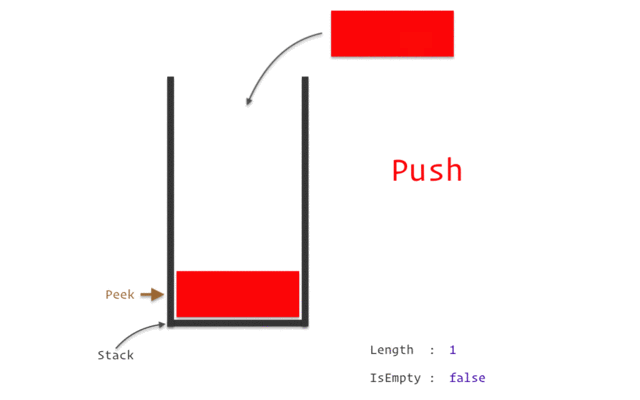

[< Назад](..%2F..%2FREADME.md)

# Стек и куча в Java

[Оригинал статьи](https://topjava.ru/blog/stack-and-heap-in-java)

<!-- TOC -->

* [Стек (Stack)](#стек-stack)
    * [Основные особенности стека](#основные-особенности-стека)
* [Куча (Heap)](#куча-heap)
    * [Эта область памяти разбита на несколько более мелких частей, называемых поколениями:](#эта-область-памяти-разбита-на-несколько-более-мелких-частей-называемых-поколениями)
* [Основные особенности кучи](#основные-особенности-кучи)
    * [Помимо рассмотренных ранее, куча имеет следующие ключевые особенности:](#помимо-рассмотренных-ранее-куча-имеет-следующие-ключевые-особенности)
    * [Рассмотрим выполнение кода по шагам:](#рассмотрим-выполнение-кода-по-шагам)
* [Сборка мусора. Как работает? Какие сборщики знаете? Какие есть области памяти в JVM?](#сборка-мусора-как-работает-какие-сборщики-знаете-какие-есть-области-памяти-в-jvm)
    * [Структура памяти Java](#структура-памяти-java)
    * [Сборка мусора: введение](#сборка-мусора-введение)
    * [Сборка мусора: процесс](#сборка-мусора-процесс)
    * [Поколения объектов](#поколения-объектов)
    * [Что такое Stop the World?](#что-такое-stop-the-world)
    * [Что такое гипотеза о поколениях?](#что-такое-гипотеза-о-поколениях)
    * [Преимущества использования поколений](#преимущества-использования-поколений)
    * [Недостатки использования поколений](#недостатки-использования-поколений)
    * [Сборка мусора: флаги](#сборка-мусора-флаги)
    * [Типы сборщиков мусора](#типы-сборщиков-мусора)

<!-- TOC -->

Для оптимальной работы приложения JVM делит память на область стека (stack) и область кучи (heap). Всякий раз, когда мы
объявляем новые переменные, создаем объекты или вызываем новый метод, JVM выделяет память для этих операций в стеке или
в куче.

В этой статье мы рассмотрим эти две области памяти: обозначим ключевые отличия между ними, рассмотрим, как они
используют память, изучим предлагаемые ими функции и как их использовать.

## Стек (Stack)



Стек работает по схеме LIFO (последним вошел, первым вышел). Всякий раз, когда вызывается новый метод, содержащий
примитивные значения или ссылки на объекты, то на вершине стека под них выделяется блок памяти. Из этого можно сделать
вывод, что стек хранит значения примитивных переменных, создаваемых в методах, а также ссылки на объекты в куче на
которые ссылается метод.

Когда метод завершает выполнение, блок памяти (frame), отведенный для его нужд, очищается, и пространство становится
доступным для следующего метода. При этом поток выполнения программы возвращается к месту вызова этого метода с
последующим переходом к следующей строке кода.

### Основные особенности стека

Помимо того, что мы рассмотрели, существуют и другие особенности стека:

- Он заполняется и освобождается по мере вызова и завершения новых методов
- Переменные в стеке существуют до тех пор, пока выполняется метод в котором они были созданы
- Если память стека будет заполнена, Java бросит исключение java.lang.StackOverFlowError
- Доступ к этой области памяти осуществляется быстрее, чем к куче
- Является потокобезопасным, поскольку для каждого потока создается свой отдельный стек

## Куча (Heap)

Эта область памяти используется для динамического выделения памяти для объектов и классов JRE во время выполнения. Новые
объекты всегда создаются в куче, а ссылки на них хранятся в стеке.

Эти объекты имеют глобальный доступ и могут быть получены из любого места программы.

### Эта область памяти разбита на несколько более мелких частей, называемых поколениями:

**1. Young Generation** — область где размещаются недавно созданные объекты. Когда она заполняется, происходит быстрая
сборка мусора

**2. Old (Tenured) Generation** — здесь хранятся долгоживущие объекты. Когда объекты из Young Generation достигают
определенного порога «возраста», они перемещаются в Old Generation

**3. Permanent Generation** — эта область содержит метаинформацию о классах и методах приложения, но начиная с Java 8
данная область памяти была упразднена. Подробнее об этом можно узнать из нашей прошлой статьи, а также посмотрев видео

Мы можем управлять размерами кучи в зависимости от наших требований.


## Основные особенности кучи

### Помимо рассмотренных ранее, куча имеет следующие ключевые особенности:

* Когда эта область памяти полностью заполняется, Java бросает java.lang.OutOfMemoryError
* Доступ к ней медленнее, чем к стеку
* Эта память, в отличие от стека, автоматически не освобождается. Для сбора неиспользуемых объектов используется
  сборщик мусора
* В отличие от стека, куча не является потокобезопасной и ее необходимо контролировать, правильно синхронизируя код

**Примеры:**

```java
class Person {
    int id;
    String name;

    public Person(int id, String name) {
        this.id = id;
        this.name = name;
    }
}

public class PersonBuilder {
    private static Person buildPerson(int id, String name) {
        return new Person(id, name);
    }

    public static void main(String[] args) {
        int id = 23;
        String name = "John";
        Person person = null;
        person = buildPerson(id, name);
    }
}
```

### Рассмотрим выполнение кода по шагам:

1. До начала выполнения метода main(), в стеке будет выделено пространство для хранения примитивов и ссылок этого
   метода:
    * примитивное значение id типа int будет храниться непосредственно в стеке;
    * ссылочная переменная name типа String будет создана в стеке, но сама строка "John" будет храниться в области,
      называемой String Pool (является частью Кучи);
    * ссылочная переменная person типа Person будет также создана в памяти стека, но будет указывать на объект,
      расположенный в куче;
2. Для вызова конструктора с параметрами Person (int, String) из метода main() в стеке, поверх предыдущего вызова метода
   main(), будет выделен блок памяти, который будет хранить:
    * **this** — ссылка на текущий объект;
    * примитивное значение **id** ;
    * ссылочную переменную **name** типа **String**, которая указывает на объект строки из пула строк;
3. В методе **main** дополнительно вызывается метод buildPerson для которого будет выделен блок памяти в стеке поверх
   предыдущего вызова. Этот блок снова сохранит переменные способом, описанным выше.
4. Для вновь созданного объекта **person** типа Person все переменные будут сохранены в памяти кучи.


---

## Сборка мусора. Как работает? Какие сборщики знаете? Какие есть области памяти в JVM?

[источник](https://habr.com/ru/companies/otus/articles/553996/)

### Структура памяти Java

**Память в Java состоит из следующих областей:**


**Native Memory** — вся доступная системная память.

**Heap (куча)** — часть native memory, выделенная для кучи. Здесь JVM хранит объекты. Это общее пространство для всех
потоков приложения. Размер этой области памяти настраивается с помощью параметра -Xms (минимальный размер) и -Xmx (
максимальный размер).

**Metaspace (метаданные)** — в этой памяти хранятся метаданные классов и статические переменные. Это пространство также
является общими для всех. Так как metaspace является частью native memory, то его размер зависит от платформы. Верхний
предел объема памяти, используемой для metaspace, можно настроить с помощью флага MaxMetaspaceSize.

**PermGen** (Permanent Generation, постоянное поколение) присутствовало до Java 7. Начиная с Java 8 ему на смену пришла
область Metaspace.

**CodeCache (кэш кода)** — JIT-компилятор компилирует часто исполняемый код, преобразует его в нативный машинный код и
кеширует для более быстрого выполнения. Это тоже часть native memory.

### Сборка мусора: введение

Что такое `мусор`? Мусором считается объект, который больше не может быть достигнут по ссылке из какого-либо объекта.
Поскольку такие объекты больше не используются в приложении, то их можно удалить из памяти.

Например, на диаграмме ниже объект fruit2 может быть удален из памяти, поскольку на него нет ссылок.


**Сборка мусора** — это процесс автоматического управления памятью. Освобождение памяти (путем очистки мусора)
выполняется автоматически специальным компонентом JVM — сборщиком мусора (Garbage Collector, GC). Нам, как
программистам, нет необходимости вмешиваться в процесс сборки мусора.


### Сборка мусора: процесс

Для сборки мусора используется алгоритм пометок (Mark & Sweep). Этот алгоритм состоит из трех этапов:

**Mark (маркировка)**. На первом этапе GC сканирует все объекты и помечает живые (объекты, которые все еще
используются). На этом шаге выполнение программы приостанавливается. Поэтому этот шаг также называется "Stop the
World" .

**Sweep (очистка)**. На этом шаге освобождается память, занятая объектами, не отмеченными на предыдущем шаге.

**Compact (уплотнение)**. Объекты, пережившие очистку, перемещаются в единый непрерывный блок памяти. Это уменьшает
фрагментацию кучи и позволяет проще и быстрее размещать новые объекты.


### Поколения объектов

Для оптимизации сборки мусора память кучи дополнительно разделена на четыре области. В эти области объекты помещаются в
зависимости от их возраста (как долго они используются в приложении).

**Young Generation (молодое поколение)**. Здесь создаются новые объекты. Область young generation разделена на три части
раздела: Eden (Эдем), S0 и S1 (Survivor Space — область для выживших).

**Old Generation (старое поколение)**. Здесь хранятся давно живущие объекты.


### Что такое Stop the World?

Когда запускается этап mark, работа приложения останавливается. После завершения mark приложение возобновляет свою
работу. Любая сборка мусора — это "Stop the World".

### Что такое гипотеза о поколениях?

Как уже упоминалось ранее, для оптимизации этапов mark и sweep используются поколения. Гипотеза о поколениях говорит о
следующем:

1. Большинство объектов живут недолго.
2. Если объект выживает, то он, скорее всего, будет жить вечно.
3. Этапы mark и sweep занимают меньше времени при большом количестве мусора. То есть маркировка будет происходить
   быстрее, если анализируемая область небольшая и в ней много мертвых объектов.

Таким образом, алгоритм сборки мусора, использующий поколения, выглядит следующим образом:


1. Новые объекты создаются в области Eden. Области Survivor (S0, S1) на данный момент пустые.

2. Когда область Eden заполняется, происходит минорная сборка мусора (Minor GC). Minor GC — это процесс, при котором
   операции mark и sweep выполняются для young generation (молодого поколения).

3. После Minor GC живые объекты перемещаются в одну из областей Survivor (например, S0). Мертвые объекты полностью
   удаляются.

4. По мере работы приложения пространство Eden заполняется новыми объектами. При очередном Minor GC области young
   generation и S0 очищаются. На этот раз выжившие объекты перемещаются в область S1, и их возраст увеличивается (
   отметка о том, что они пережили сборку мусора).

5. При следующем Minor GC процесс повторяется. Однако на этот раз области Survivor меняются местами. Живые объекты
   перемещаются в S0 и у них увеличивается возраст. Области Eden и S1 очищаются.

6. Объекты между областями Survivor копируются определенное количество раз (пока не переживут определенное количество
   Minor GC) или пока там достаточно места. Затем эти объекты копируются в область Old.

7. Major GC. При Major GC этапы mark и sweep выполняются для Old Generation. Major GC работает медленнее по сравнению с
   Minor GC, поскольку старое поколение в основном состоит из живых объектов.

### Преимущества использования поколений

Minor GC происходит в меньшей части кучи (~ 2/3 от кучи). Этап маркировки эффективен, потому что область небольшая и
состоит в основном из мертвых объектов.

### Недостатки использования поколений

В каждый момент времени одно из пространств Survivor (S0 или S1) пустое и не используется.

### Сборка мусора: флаги

В этом разделе приведены некоторые важные флаги, которые можно использовать для настройки процесса сборки мусора.

| Флаг                       | Описание                                                                                |
|----------------------------|-----------------------------------------------------------------------------------------|
| -Xms                       | Первоначальный размер кучи                                                              |
| -Xmx                       | Максимальный размер куча                                                                |
| -XX:NewRatio=n             | Отношение размера Old Generation к Young Generation                                     |
| -XX:SurvivorRatio=n        | Отношение размера Eden к Survivor                                                       |
| -XX:MaxTenuringThreshold=n | Возраст объекта, когда объект перемещается из области Survivor в область Old Generation |

### Типы сборщиков мусора

| Сборщик мусора | Описание                                                             | Преимущества                                                                                                                     | Когда использовать                                                                                                                                                                                                                                | Флаги для включения |
|----------------|----------------------------------------------------------------------|----------------------------------------------------------------------------------------------------------------------------------|---------------------------------------------------------------------------------------------------------------------------------------------------------------------------------------------------------------------------------------------------|---------------------|
| Serial         | Использует один поток.                                               | Эффективный, т.к. нет накладных расходов на взаимодействие потоков.                                                              | Однопроцессорные машины.<br/><br/>Работа с небольшими наборами данных.                                                                                                                                                                            | -XX:+UseSerialGC    |
| Parallel       | Использует несколько потоков.                                        | Многопоточность ускоряет сборку мусора.                                                                                          | В приоритете пиковая производительность.<br/><br/>Допустимы паузы при GC в одну секунду и более.<br/><br/>Работа со средними и большими наборами данных.<br/><br/>Для приложений, работающих на многопроцессорном или многопоточном оборудовании. | -XX:+UseParallelGC  |
| G1             | Выполняет некоторую тяжелую работу параллельно с работой приложения. | Может использоваться как на небольших системах, так и на больших с большим количеством процессоров и большим количеством памяти. | Когда время отклика важнее пропускной способности.<br/><br/>Паузы GC должны быть меньше одной секунды.                                                                                                                                            | -XX:+UseG1GC        |
| Z1             | Выполняет всю тяжелую работу параллельно с работой приложения.       | Низкая задержка.                                                                                                                 | В приоритете время отклика.                                                                                                                                                                                                                       | +UseZGC             |

Что будет с двумя или более объектами, которые ссылаются только друг на друга,
но больше не на кого и никому не нужны - как с ними поступит сборщик и как именно это будет делать?